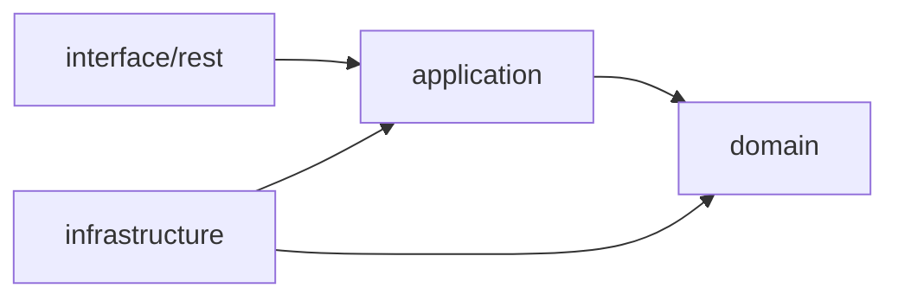

# Architecture Notes

This project follows a clean architecture style with explicit boundaries:

- **Domain**: Business model (`TaskItem`) and domain exceptions.
- **Application**: Use-case API (`TaskUseCase`) and ports (`TaskRepository`).
- **Infrastructure**: In-memory adapter implementing repository port.
- **Interface (REST)**: HTTP controller, DTOs, mappers, global error handling.

## Dependency direction

Outer layers depend on inner abstractions, not concrete implementations.

## Demo scenario

1. Client sends `POST /api/v1/tasks` with title/description.
2. Controller validates request, creates use-case command.
3. Use-case checks duplicate title and creates domain entity.
4. Repository stores entity in memory.
5. Response DTO is returned with HTTP 201 and `Location` header.
